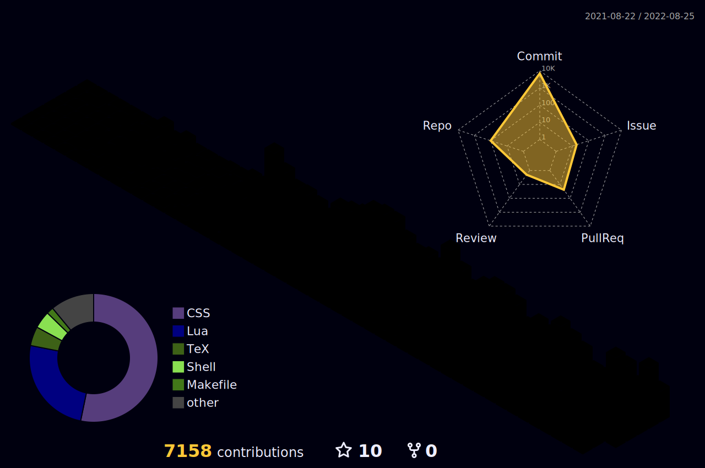

<!--  -->
<!--  -->
<!--  -->

<!--  -->

<!-- banner 

-->

<!-- badges -->

<!--  -->

<h2>💼 repo</h2>
<table>
  <thead align="center">
    <tr>
      <th>项目</th>
      <th>简述</th>
      <th>技术栈</th>
      <th>Star</th>
    </tr>
  </thead>
  <tbody align="left">
  <!-- tiddlywiki-starter-kit -->
    <tr>
      <th>
        <a href="https://github.com/oeyoews/tiddlywiki-starter-kit" target="_blank">
        tiddlywiki-starter-kit</a>
      </th>
      <th>📦 使用 tiddlywiki 搭建的本地优先的笔记软件</th>
      <th>
        
        
      </th>
      <th>
        
      </th>
    </tr>
	<!-- nextjs-mdx-blog -->
    <tr>
      <th>
        <a href="https://github.com/oeyoews/nextjs-mdx-blog" target="_blank">
        nextjs-mdx-blog</a>
      </th>
	  <th>📝 支持多种数据源的 Blog, 使用 Nextjs14 构建</th>
      <th>
        
        
      </th>
      <th>
        
      </th>
    </tr>
	<!-- react-music -->
    <tr>
      <th>
        <a href="https://github.com/oeyoews/react-music" target="_blank">
		react-music
        </a>
      </th>
	  <th>
	  🎶  使用 nextjs14 构建的在线音乐播放器
	  </th>
      <th>
        
        
      </th>
      <th>
        
      </th>
    </tr>
    <tr>
      <th>
        <a href="https://github.com/oeyoews/reading-books-with-tiddlywiki" target="_blank">
		reading-books-with-tiddlywiki
        </a>
      </th>
	  <th>
	   📖 使用 tiddlywiki 构建的在线书籍阅读器
	  </th>
      <th>
        
        
      </th>
      <th>
        
      </th>
    </tr>
  </tbody>
</table>

<!-- summary -->
<!-- <h2>📈 Trending</h2> -->

---

<!-- medals -->
<h2>🏆 Github Profile Trophy</h2>

  

<!--
<h2>☕ Recent Activities</h2>

 
-->
<!--  -->

<!--
<h2>🧪 Repositories</h2>

-->
